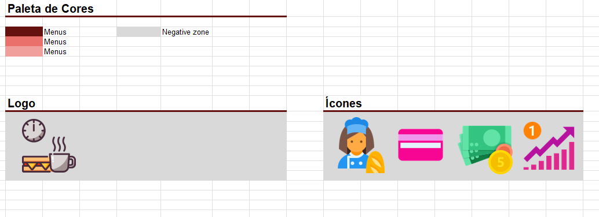
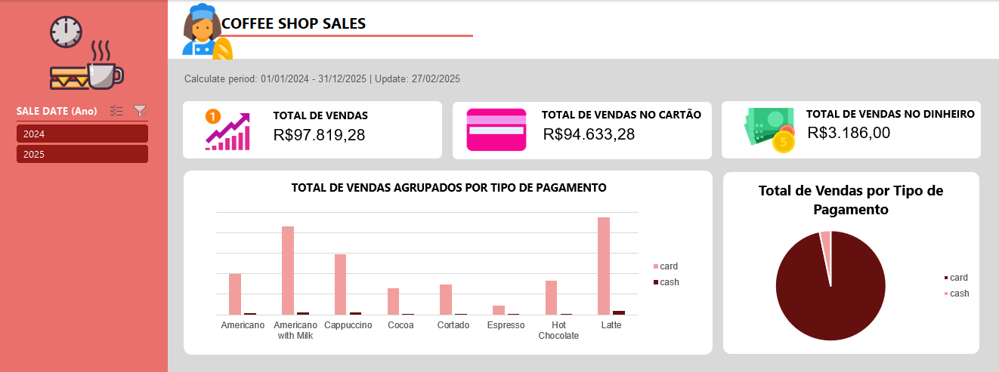

# ☕ Dashboard de Vendas da Cafeteria: Uma Dose de Insights! 📊

##  🚀 Visão Geral 

Bem-vindo(a) ao dashboard de vendas da cafeteria! Este projeto foi criado para transformar dados brutos em informações acionáveis, permitindo uma análise clara e concisa do desempenho das vendas. O objetivo principal é fornecer aos proprietários e gestores da cafeteria uma visão abrangente das vendas, identificando tendências, produtos de destaque e oportunidades de otimização.

Este projeto foi inspirado no desafio proposto pelo professor [Felipe Silva Aguiar](https://www.linkedin.com/in/felipeaguiar-exe/), Tech Lead da **[DIO](https://www.dio.me/)**, no **Bootcamp [Heineken](https://www.linkedin.com/company/heineken/posts/?feedView=all) - Inteligência Artificial Aplicada a Dados com Copilot** no curso ***'Criando um Dashboard de Vendas do Xbox com Excel'***. A proposta era utilizar um outro dataset, com isso escolhi de uma cafeteria.

 

## 🤔 O que você encontrará aqui? 

*   **Visualizações Impactantes:** Gráficos e tabelas dinâmicas que facilitam a identificação de padrões e tendências nas vendas.
*   **Análise Detalhada:** Respostas para perguntas de negócios cruciais, como o desempenho de cada tipo de café e a preferência dos clientes por diferentes métodos de pagamento.
*   **Código Aberto (em Excel!):** Uma planilha do Excel totalmente funcional, com todas as fórmulas e formatações visíveis para você aprender e adaptar.

 

## 🛠️ Tecnologias e Ferramentas Utilizadas 

*   **Microsoft Excel:** A ferramenta principal para a criação do dashboard.
*   **Kaggle:** Fonte do dataset de vendas da cafeteria. ([https://www.kaggle.com/datasets/ihelon/coffee-sales](https://www.kaggle.com/datasets/ihelon/coffee-sales))
*   **FreeConvert:** Conversor online para transformar o arquivo CSV em XLSX. ([https://www.freeconvert.com/pt/csv-to-xlsx](https://www.freeconvert.com/pt/csv-to-xlsx))
*   **Icons8 & Flaticon:** Plataformas para encontrar ícones atraentes para o dashboard. ([https://icons8.com.br/icons](https://icons8.com.br/icons), [https://www.flaticon.com/br/](https://www.flaticon.com/br/))

 

## 📂 Estrutura do Projeto 

O arquivo do Excel está organizado em quatro abas principais:

1.  **Assets:** Contém a paleta de cores, logo e ícones utilizados no dashboard para manter a consistência visual.
2.  **Base de Dados:** Os dados brutos do dataset de vendas.
3.  **Cálculos e Tabelas Dinâmicas:** Cálculos intermediários e tabelas dinâmicas que respondem às perguntas de negócios.
4.  **Dashboard:** A visualização final dos dados, com gráficos e indicadores chave de performance (KPIs).

 

## ❓ Perguntas de Negócios Respondidas 

O dashboard foi projetado para responder às seguintes perguntas de negócios:

1.  Valor total de venda por café e tipo de pagamento.
2.  Valor de vendas mensais por tipo de café.
3.  Valor de vendas anuais por tipo de café.
4.  Vendas totais por tipo de pagamento.

 

## 🖼️ Imagens do Dashboard 

### Aba Assets
A aba Assets foi desenvolvida para organizar os elementos visuais utilizados no dashboard, garantindo consistência e facilitando a manutenção do projeto.

   

### Dashboard Final
O dashboard final fornece uma visão geral das vendas da cafeteria, destacando os principais indicadores e padrões de desempenho.

   

O dashboard apresenta:

*   **Visão Geral das Vendas:**  Total de vendas, vendas no cartão, vendas em dinheiro.
*   **Gráfico de Barras:** Total de vendas agrupadas por tipo de pagamento, detalhando as vendas de cada tipo de café (Americano, Americano with Milk, Cappuccino, Cocoa, Cortado, Espresso, Hot Chocolate, Latte) por meio de cartão e dinheiro.
*   **Gráfico de Pizza:** Distribuição total das vendas por tipo de pagamento (cartão e dinheiro), proporcionando uma visão clara da proporção entre os métodos de pagamento.

 

## 🖱️ Como usar este Dashboard? 

1.  **Baixe o arquivo do Excel.**
2.  **Abra no Microsoft Excel.**
3.  **Explore as abas:** Navegue entre as abas para entender a estrutura dos dados e os cálculos realizados.
4.  **Interaja com os filtros:** Utilize os filtros nas tabelas dinâmicas e gráficos para segmentar os dados e obter insights mais específicos.
5.  **Adapte e personalize:** Sinta-se à vontade para modificar o dashboard de acordo com as suas necessidades.

 

## 🤝 Contribuição 

Sinta-se à vontade para contribuir com este projeto! Se você tiver sugestões de melhorias, correções de bugs ou novas funcionalidades, abra uma issue ou envie um pull request.

 

## Licença 📝

Este projeto está licenciado sob a [Licença MIT](https://opensource.org/licenses/MIT).

Espero que este dashboard seja útil para você! 😊

 
